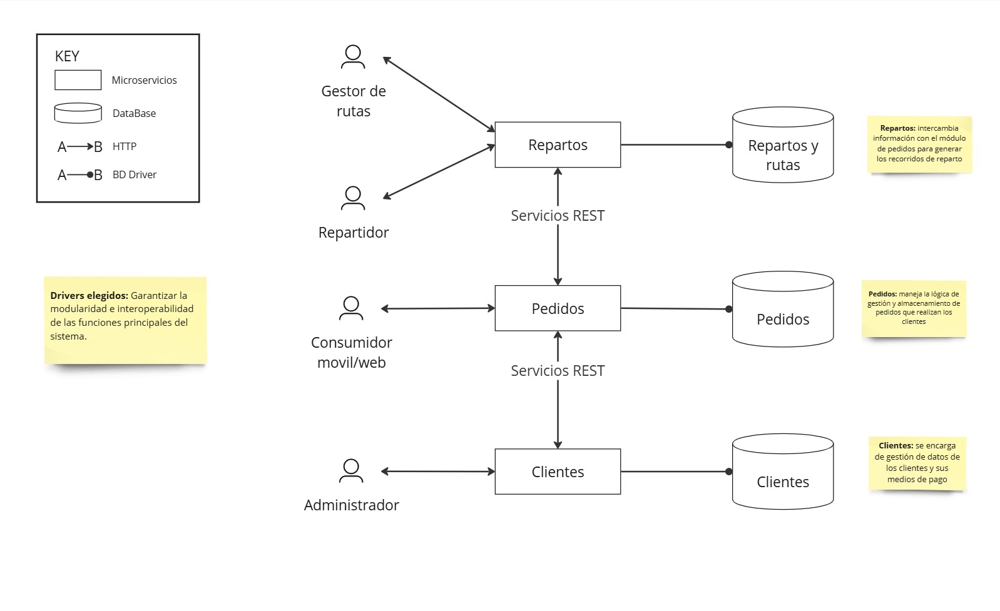

# Iteración 1

# **ADR 001**

## **Titulo**

Migración de Sistema Monolítico de Aplicación de Alimentos a Microservicios.

## **Motivación**

La empresa de productos alimenticios tiene la intención de migrar su sistema monolítico existente a una arquitectura más flexible y evolutiva, alineándose con su objetivo de reducir la rigidez y mejorar la mantenibilidad. La lógica de negocio de la empresa consiste en módulos funcionales con diferentes grados de criticidad, y se pretende reemplazar el acceso al sistema existente por protocolos HTTP/REST. El requisito principal es garantizar una alta disponibilidad y seguridad para la funcionalidad de Clientes, mientras se mantiene la consistencia de datos en las dos bases de datos SQL.

La decisión de la empresa de adoptar el Patrón de Arquitectura de Microservicios está impulsada por la necesidad de escalabilidad, flexibilidad, mantenibilidad y resiliencia. Esta decisión tiene como objetivo abordar los requisitos del sistema, incluyendo la necesidad de alta disponibilidad y seguridad para la funcionalidad de Clientes, al tiempo que se garantiza la consistencia de datos en las dos bases de datos SQL.

## **Drivers**

**Drivers elegidos:** Garantizar la modularidad e interoperabilidad de las funciones principales del sistema.

**Justificación:** para comenzar el diseño del sistema debemos estructurar una arquitectura modular del sistema general que antes era de carácter monolítico. Esto nos permitirá en las siguientes iteraciones estructurar cada modulo para satisfacer sus escenarios de calidad específicos.

**Meta:** Descomponer y diseñar los microservicios de `Clientes`, `Pedidos`, y `Reparto y rutas`, asegurando una integración robusta entre ellos que permita la interoperabilidad continua y la preparación para futuras expansiones como `Pagos` y `Estadísticas`.

En este caso tenemos un sistema greenfield, ya que comenzamos el diseño desde cero para rediseñarlo con un enfoque modular, por lo tanto el componente a refinar es el sistema en sí.

## **Decisión principal**

Se adoptará el Patrón de Arquitectura de Microservicios para abordar los requisitos del sistema. Esta decisión se alinea con el objetivo de la empresa de reducir la rigidez y mejorar la mantenibilidad, al tiempo que garantiza una alta disponibilidad y seguridad para la funcionalidad de Clientes⁠.

La decisión asume que la empresa tiene un buen entendimiento del Patrón de Arquitectura de Microservicios y sus beneficios. También asume que la empresa tiene un plan claro para descomponer la aplicación en servicios, definir los límites de los servicios e implementar la comunicación entre ellos⁠.

**Ventajas de utilizar microservicios:**

- **Agilidad:** Los diferentes partes de un programa se pueden dividir en pequeños equipos de desarrollo especializados, aumentando así la productividad a la vez que se reduce el ciclo de desarrollo.
- **Escalables y flexibles:** Los microservicios se pueden escalar de forma independiente en caso de aumentar la demanda en cierta característica del software.
- **Libertad de desarrollo:** Cada microservicio puede desarrollarse con una tecnología o herramienta específica, sin necesidad de que las otras partes también las tengan que utilizar.
- **Consistencia:** cuando un software está dividido en muchas partes pequeñas, su consistencia y resistencia a los errores aumenta notablemente, al contrario de lo que ocurre en una arquitectura monolítica.

**Desventajas de utilizar microservicios:**

- **Alto consumo de memoria:** al tener cada microservicio sus propios recursos y bases de datos, consumen más memoria y CPU.
- **Complejidad en la gestión:** si contamos con un gran número de microservicios, será más complicado controlar la gestión e integración de los mismos.
- **Dificultad en la realización de pruebas:** debido a que los componentes de la aplicación están distribuidos, las pruebas y test globales son más complicados de realizar.
- **Coste de implantación alto:** una arquitectura de microservicios puede suponer un alto coste de implantación debido a costes de infraestructura y pruebas distribuidas.

**Diagrama de la estructura de microservicios:**

Este diagrama representa la vista de componentes de la arquitectura basada en microservicios. Los módulos principales (Clientes, Pedidos, y Repartos) están diseñados para operar de manera independiente, comunicándose a través de servicios REST. La modularidad de la arquitectura permite escalabilidad horizontal, mientras que cada microservicio mantiene su propia base de datos para garantizar independencia y encapsulación.

*Descripción:*

Los módulos principales del sistema son:

- *Clientes:* microservicio encargado de la gestión de los datos de los clientes, junto con el sistema de pago de los pedidos. Posee su propia base de datos relacional donde se almacena dicha información.
- *Pedidos:* microservicio encargado de la gestión y almacenamiento de los pedidos realizados. Cuando se realiza un pedido, el modulo de pedidos se lo informa al modulo de clientes, solicitando la información necesaria del cliente para la autenticación y el almacenamiento del pedido en su base de datos.
- *Repartos y rutas:* microservicio encargado de intercambiar información con el modulo de Pedidos para gestionar los repartos de los mismos. Almacenando los datos de los repartidores y asignándoles los pedidos que les correspondan.

## *Alternativas rechazadas*

*Repartos y rutas acoplado con Pedidos*

Los servicios de “Repartos y rutas” y “Pedidos” se encuentran conectados a la misma base de datos para poder acceder a los pedidos y mantener la consistencia de los repartos de manera mas simple.

Ésta alternativa *fue rechazada* porque no cumple con el criterio de no acoplamiento en microservicios, ya que ambos se encuentran acoplados por la misma base de datos, por lo tanto una falla de uno puede producir una falla en el otro.

*Servicios con BD Compartida*

Los servicios del sistema se encuentran conectados a la misma base de datos, para aumentar la performance evitando agregaciones o ensamblados de distintas bases de datos.

Ésta alternativa *fue rechazada* porque introduce acoplamiento entre servicios ademas de un overhead en la base de datos que puede producir fallos al aumentar la cantidad de solicitudes por unidad de tiempo

## Consecuencias

Los beneficios de elegir una arquitectura basada en microservicios son amplios y se ha hablado mucho de ellos a lo largo de éste documento. A su vez, la distribución de responsabilidades escogida en la cuál cada microservicio se encarga de mantener su propia persistencia asegura una buena modularidad y a partir de ello una buena mantenibilidad a futuro. Las funciones principales del sistema se dividieron en servicios de forma desacoplada que interactuan para llevar a cabo sus responsabilidades. Esto nos provee una mayor interoperabilidad del sistema ya que cada uno de los componentes se comunica entre sí y con los servicios externos que sean necesarios. Además, se provee mayor flexibilidad en distintos aspectos como la elección de tecnologías específicas, patrones, frameworks, e infraestructura de cada servicio lo que facilita el deployment y la migración al protocolo HTTP facilita el acceso desde clientes web o móbiles.

De todos modos, algunos desafíos surgen de las decisiones tomadas:
- **Performance:** el uso de microservicios que se deben comunicar vía redes puede generar más overhead y demoras que en una aplicación monolítica no sucedería.
- **Alta flexibilidad:** la alta flexibilidad puede ser una ventaja en ciertos aspectos, pero por otro lado nos pone el desafío de trabajar con un marco de referencia adecuado para las futuras decisiones que tomen los equipos de desarrollo individuales.
- **Conocimiento técnico:** también será necesario que cada equipo pueda contar con miembros con alto conocimiento técnico de las distintas tecnologías y del desarrollo de microservicios.
- **Trabajo con múltiples bases:** si bien es cierto que para desacoplar los servicios se decidió que cada uno tuviera su propia base de datos, esto puede traer consecuencias negativas en la performance de la comunicación al tener que estar haciendo muchas solicitudes por transacción del sistema a una memoria secundaria, y además mantener la consistencia lógica entre sí, ya que la información que almacenan está relacionada por la lógica del negocio. 

