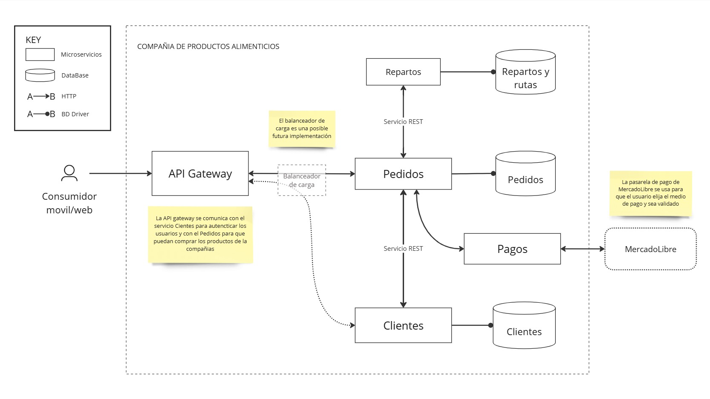

## **ADR 002**

### **Titulo**

Autenticación, redirección y aislación de pagos.

**Motivación**

Dado que la seguridad de los datos de los clientes y la integridad de las transacciones de pagos son aspectos críticos, es esencial que el diseño arquitectónico priorice estos atributos de calidad. Implementar patrones para la autenticación y autorización garantizará un control de acceso seguro y confiable, protegiendo los datos personales. 

Asimismo, la integración de un microservicio de pagos con la pasarela de MercadoLibre proporcionará un entorno de transacciones seguro, fortaleciendo la confianza del cliente y mejorando la reputación de la empresa. 

**Drivers elegidos:** Garantizar la seguridad de los datos del cliente.

**Justificación:** Este driver ha sido seleccionado debido a la criticidad del modulo 'Pedidos' y ‘Clientes’, que contienen información altamente sensible y deben cumplir con estándares de seguridad estrictos para prevenir accesos no autorizados, brechas de datos y fraudes.

**Meta:** Diseñar una arquitectura de microservicios que optimice la seguridad de los datos personales de los clientes y las transacciones de pagos, garantizando un acceso controlado, autenticado y autorizado.

**Componente a refinar**: Módulo de Clientes y Pedidos

## **Decisión principal**

Para gestionar la autenticación y autorización de forma centralizada y eficiente, se opta por implementar un modulo **API Gateway** que interceptará todas las solicitudes de los usuarios y delegará las peticiones a los microservicios correspondientes después de validarlas.  Y también se decidió crear un modulo **Pago** que actúa de adaptador (y aislador) con la pasarela externa.

**Flujo de pedidos**

1. **Autenticación centralizada**:
    - Cuando el usuario intenta realizar un pedido, su solicitud pasa primero por el **API Gateway**.
    - El **API Gateway** valida la autenticación del usuario. Para esto, se conecta con el **microservicio de Clientes** para verificar los datos de autenticación del usuario (por ejemplo, correo electrónico y contraseña).
    - Si la autenticación es exitosa, el **API Gateway** emite un **token de acceso** que el usuario adjuntará a las futuras solicitudes (en la cabecera `Authorization`) que incluye:
        - Información del usuario (por ejemplo, ID de usuario, nombre).
        - Roles y permisos del usuario.
        - Tiempo de expiración del token.
        - Una firma digital para garantizar la integridad del token.
2. **Redirección a microservicios**:
    - Una vez autenticado el usuario, el **API Gateway** redirige la solicitud hacia el microservicio de **Pedidos**.
    - El microservicio de **Pedidos** se encarga de gestionar los productos que el usuario desea comprar y preparar la orden.
3. **Integración con Pasarela de Pagos**:
    - Al confirmar el pedido, el microservicio de **Pedidos** se conecta con el microservicio de **Pagos**, que actúa como un adaptador hacia una pasarela externa de pagos (como **MercadoLibre**).
    - El pago es procesado por la pasarela de pagos, y si la transacción es exitosa, el pedido se completa.
4. **Almacenamiento de Pedido y Envío de Factura**:
    - El microservicio de **Pedidos** almacena la información del pedido en la **base de datos de Pedidos**.
    - Luego, envía una factura de pago al **microservicio de Clientes**, que se encarga de adjuntar la factura al registro del cliente correspondiente en la **base de datos de Clientes**.

**Flujo de acceso a datos de clientes**

1. **Autenticación centralizada**:
    - Cuando el administrador intenta acceder a datos de los clientes, su solicitud pasa primero por el **API Gateway**.
    - Luego al validar la autenticación del administrador, se retorna un **token de acceso**
2. **Redirección a microservicios**:
    - Una vez autenticado el administrador, el **API Gateway** redirige la solicitud hacia el microservicio de **Clientes**.
    - El microservicio de **Clientes** se encarga de gestionar y obtener los datos de los clientes.

**Ventajas de utilizar API Gateway:**

- **Reducción de Complejidad:** Asegura que todos los microservicios reciban solicitudes ya autenticadas, sin tener que implementar lógica de autenticación propia en cada uno.
- **Seguridad Uniforme**: Todos los microservicios pueden confiar en que el cliente ya ha sido autenticado y solo necesitan validar el token. Esto reduce la superficie de ataque y asegura que las políticas de autenticación se gestionen de forma centralizada.
- **Modificabilidad:** Si se agregan nuevos microservicios al sistema, la lógica de validación ya estaría implementada y sólo se debería diseñar el sistema de validación de tokens en en dicho microservicio.
- **Escalabilidad**: La validación de tokens en cada microservicio es mucho más ligera y rápida que la autenticación completa, lo que ayuda a mantener la eficiencia. Además la API Gateway puede (en un futuro) enviar las solicitudes a un balanceador de carga.

**Desventajas potenciales de la API Gateway:**

- **Dependencia en el Servidor de Autenticación**: Si el servidor de autenticación central falla o tiene problemas, los clientes no pueden obtener nuevos tokens. Sin embargo, los microservicios pueden seguir funcionando y validando tokens ya emitidos hasta que estos expiren.
- **Renovación de Tokens**: Es necesario gestionar de forma adecuada la expiración y renovación de tokens para mantener sesiones seguras y activas.

## ***Alternativas rechazadas***

### **Autenticación Basada en Microservicios Independientes**

Cada microservicio es responsable de su propia autenticación y validación de tokens. No hay un único punto de entrada; los microservicios operan de manera independiente, pero cada uno valida el token JWT al recibir solicitudes. 

**Ventajas:** No hay un solo punto de control, lo que puede aumentar la flexibilidad y escalabilidad.

**Desventajas:** Si el sistema crece y más microservicios se agregan, la administración de tokens se vuelve más compleja, ya que todos los microservicios deben estar alineados en cuanto a las políticas de autenticación y autorización. Duplicaría esfuerzos y generaría repetición de código y redundancia entre servicios

En conclusión si bien la centralización de la autenticación en una API Gateway trae problemas de flexibilidad, los mecanismos descentralizados son más complejos de mantener y duplican lógica. Por lo tanto esta opción quedó descartada y continuamos evaluando opciones de autenticación centralizada.

### **Autenticación basada en Proveedor de Identidad Externo (IdP)**

Este enfoque utiliza un servicio externo para gestionar la autenticación y autorización de los usuarios. Los microservicios no se encargan de la autenticación directamente sino que se delega a un sistema de gestión de identidades (IdP), como **OAuth 2.0**, **OpenID Connect (OIDC)**, o un proveedor como **Auth0**, **Okta**, o **Keycloak**.

**Flujo:** 

- El cliente se autentica con un **Proveedor de Identidad Externo** (IdP).
- El IdP valida las credenciales del cliente (por ejemplo, nombre de usuario y contraseña, autenticación multifactor) y si son correctas emite un **token de acceso.**
- Cada microservicio valida el **token de acceso** con el IdP para asegurarse de que es válido. Generalmente, esto se hace utilizando un **middleware** que se conecta al IdP o a un servidor de autorización centralizado.

**Ventajas:**  

- El IdP maneja la autenticación y la gestión de usuarios, lo que **descentraliza** la lógica de autenticación de los microservicios y elimina la necesidad de que cada uno valide credenciales o gestione el ciclo de vida de los usuarios.
- Los microservicios simplemente validan los tokens emitidos por el IdP, lo que reduce la carga de trabajo en los microservicios y mejora la seguridad al contar con un sistema especializado en la gestión de identidades.

**Desventajas:**

- **Dependencia del Proveedor de Identidad**: Si el **IdP** experimenta problemas, toda la autenticación en el sistema podría fallar, afectando a todos los microservicios que dependen de él.
- **Complejidad en la Integración**: Los microservicios deben estar preparados para comunicarse con el IdP y validar los tokens de acceso, lo que puede requerir un desarrollo adicional y un middleware específico para la validación de tokens.
- **Riesgos de Seguridad:** La **seguridad del IdP** es crucial. Si el IdP se ve comprometido, todos los microservicios y usuarios que dependen de él podrían estar en riesgo.

En conclusión, este mecanismo nos provee las mismas ventajas que un API Gateway pero agregándole desventajas como la dependencia de un proveedor externo. Por lo tanto, también se descartó.
