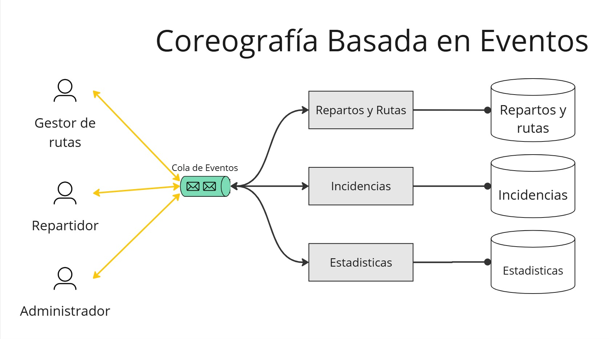
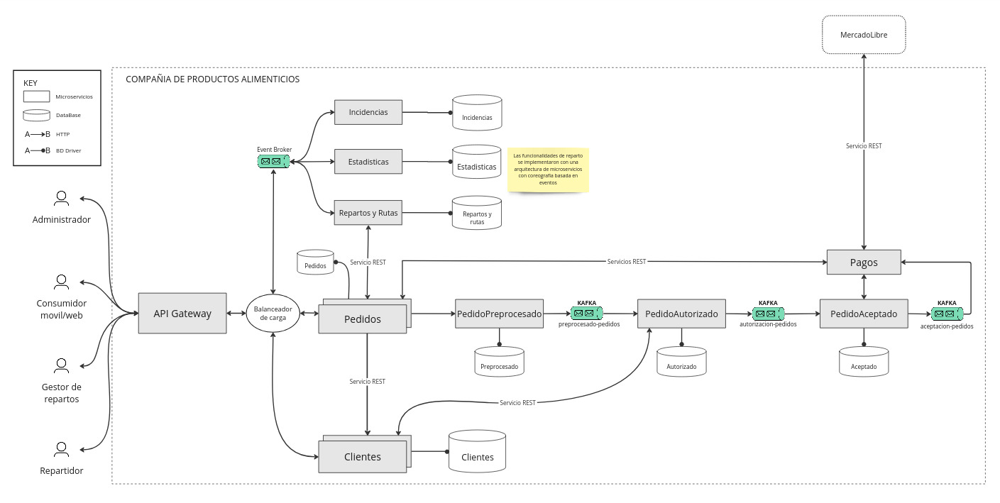
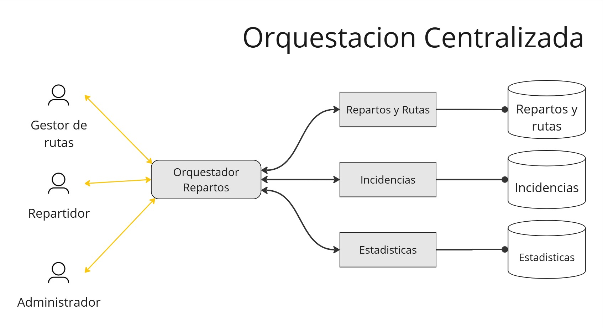
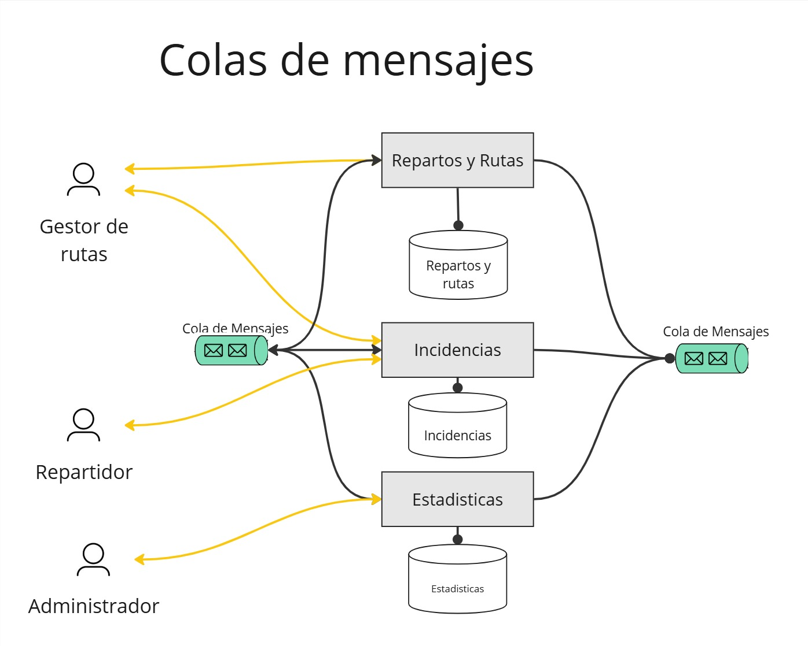
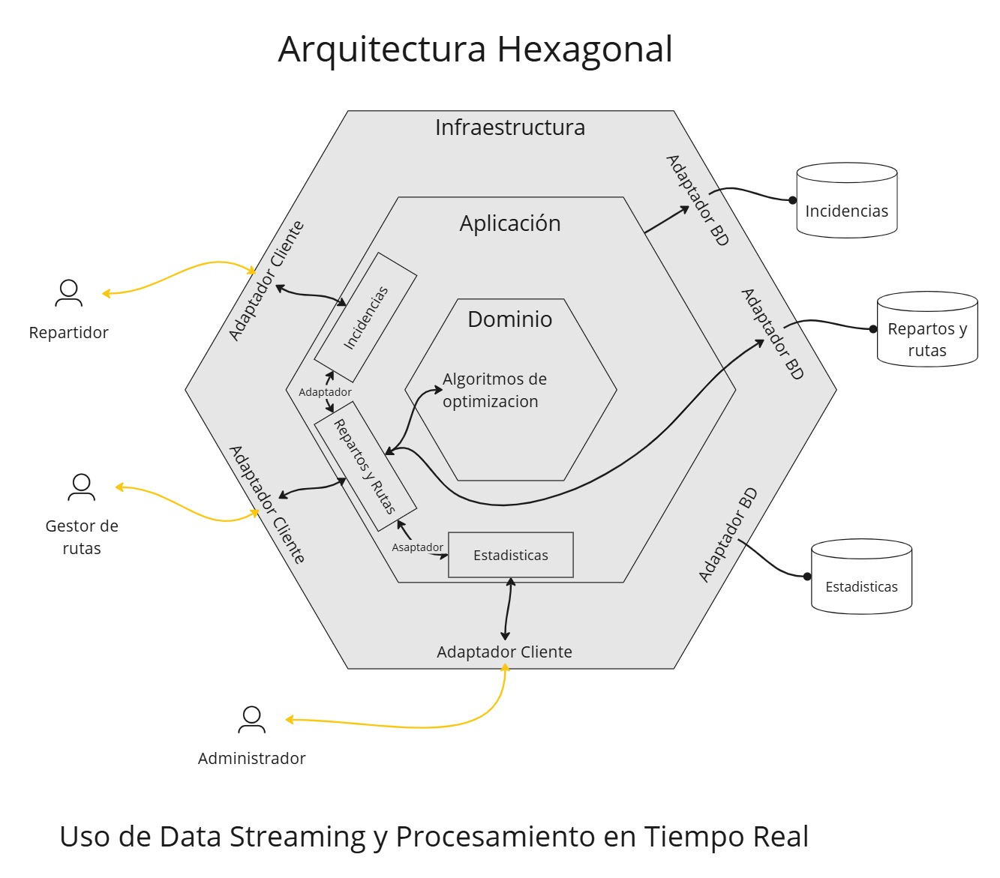

## **ADR 004**

### **Titulo**

Optimización de arquitectura para el modulo de **Reparto y Pedidos**

**Motivación**

El módulo de gestión de reparto de pedidos y rutas es un componente crítico, ya que maneja la asignación de rutas y la optimización de la entrega de pedidos. La arquitectura debe ser lo suficientemente flexible y eficiente para soportar algoritmos de optimización en tiempo real, gestionar la flota de transporte y asegurar que los repartos se realicen de manera oportuna y sin problemas. Además, la capacidad de reportar y responder rápidamente a los incidentes en las rutas es fundamental.

**Drivers elegidos:** 

**User Stories:**

- Como **gestor de rutas** quiero gestionar las rutas para obtener el mejor recorrido según el momento del día.
- Como **gestor de rutas** quiero gestionar los repartos para que cada cliente obtenga su producto en tiempo y forma.
- Como **gestor de rutas** quiero ver los incidentes de rutas y repartos para solucionarlos lo más rápido posible.
- Como **repartidor de pedidos** quiero ingresar las incidencias de cada reparto para que se solucionen rápidamente.

**Atributos de Calidad:**

- **Escalabilidad**: Necesidad de procesar grandes volúmenes de rutas y repartos simultáneamente.
- **Performance**: Minimizar tiempos de respuesta para garantizar que los algoritmos de optimización y la asignación de rutas sean eficientes.
- **Disponibilidad**: Continuar las operaciones de reparto y rutas incluso en caso de fallos parciales.
- **Modificabilidad**: Los diferentes componentes deben operar de forma independiente para facilitar el mantenimiento y la escalabilidad.

**Justificación:** 

La elección de estos drivers se basa en la criticidad del módulo de **Gestión de Reparto y Rutas**, que tiene un impacto directo en la entrega y en la experiencia del cliente. Las **user stories** seleccionadas reflejan la necesidad de un sistema que soporte operaciones en tiempo real y gestione las complejidades de las rutas de reparto, priorizando la optimización y la capacidad de respuesta. Y los **atributos de calidad** se eligieron debido a que la velocidad de respuesta, la disponibilidad y la capacidad de modificar el sistema son escenciales para asegurar la confiabilidad para con el usuario y la eficacia del servicio.

**Meta:** Asegurar un sistema de gestión de reparto de pedidos y rutas que optimice las entregas, maneje eficazmente los cambios en tiempo real y pueda responder rápidamente a incidencias.

**Componente a refinar**: El módulo de **Gestión de Reparto y Rutas** y su integración con los módulos de **Estadísticas** e **Incidencias.**

## Alternativas

- Arquitectura de Microservicios con Orquestación Centralizada
- **Arquitectura de Microservicios con Coreografía Basada en Eventos**
- Arquitectura Basada en Colas de Mensajes (Kafka, RabbitMQ)
- Arquitectura Hexagonal para la Gestión de Algoritmos de Optimización
- Uso de Data Streaming y Procesamiento en Tiempo Real

## Alternativa elegida

### **Arquitectura de Microservicios con Coreografía Basada en Eventos**

- **Aplicación**: Los módulos operan de forma autónoma, comunicándose mediante eventos publicados y suscritos en una infraestructura de mensajería (por ejemplo, Kafka). No hay orquestador central; **cada módulo decide cómo actuar al recibir ciertos eventos.**
- **Reparto y Rutas**: Publica eventos cuando se asignan rutas o se actualizan las condiciones de los camiones. Escucha eventos de otros módulos para adaptar las rutas en tiempo real.
- **Estadísticas**: Se suscribe a eventos generados por **Reparto y Rutas** e **Incidencias** para procesar y mostrar datos en tiempo real.
- **Incidencias**: Publica eventos cuando se detectan problemas y escucha respuestas de los otros módulos que pueden influir en la ruta y el reparto.
- **Ventajas**:
    - **Desacoplamiento**: Cada microservicio es autónomo, lo que facilita el mantenimiento y la escalabilidad.
    - **Resiliencia**: La falla de un microservicio no afecta directamente a los otros, promoviendo la alta disponibilidad.
    - **Escalabilidad**: Permite escalar servicios de forma independiente según las necesidades.
- **Desventajas**:
    - **Complejidad en el Rastreo**: Puede ser difícil entender y mantener el flujo de trabajo al distribuir la lógica.
    - **Consistencia Eventual**: La sincronización entre servicios puede ser compleja, y no siempre hay una consistencia inmediata.
    - **Mayor Sobrecarga Operativa**: Requiere un manejo cuidadoso de la comunicación por eventos para evitar ciclos o problemas de orquestación implícita.

---

## Alternativas rechazadas

### **Arquitectura de Microservicios con Orquestación Centralizada**

- **Aplicación**: Un orquestador central (por ejemplo, Camunda o Zeebe) controlaría el flujo de procesos entre los módulos de **Reparto y Rutas**, **Estadísticas**, e **Incidencias**. Cada módulo ejecutaría sus tareas específicas y reportaría al orquestador el estado de su ejecución.
- **Reparto y Rutas**: Gestiona la asignación de rutas y la ejecución de los algoritmos de optimización, recibiendo instrucciones del orquestador y enviando resultados una vez completadas.
- **Estadísticas**: Recibe y procesa datos de eventos orquestados para actualizar informes en tiempo real sobre el estado de los camiones y los pedidos.
- **Incidencias**: Responde a eventos de fallo o problemas reportados y actualiza al orquestador sobre las acciones correctivas.
- **Ventajas**:
    - **Control Centralizado**: Permite un control más fácil de los flujos complejos y visibilidad sobre el proceso completo.
    - **Coordinación Efectiva**: Facilita la implementación de procesos que requieren múltiples pasos secuenciales.
    - **Trazabilidad**: Simplifica el seguimiento y la depuración de las operaciones, ya que el orquestador central gestiona el flujo.
- **Desventajas**:
    - **Punto de Falla Potencial**: Si el orquestador central falla, podría interrumpir todo el proceso.
    - **Escalabilidad Limitada**: Puede convertirse en un cuello de botella si no se diseña con escalabilidad en mente.
    - **Dependencia del Orquestador**: Introduce un punto de dependencia adicional en la arquitectura.

Rechazada porque la desventaja de tener un punto de falla único limita mucho la escalabilidad del sistema.

### **Arquitectura Basada en Colas de Mensajes (Kafka, RabbitMQ)**

- **Aplicación**: Se usarían colas de mensajes para comunicar de forma asíncrona los módulos. Cada módulo recibiría tareas de una cola y publicaría sus resultados en otra, permitiendo un flujo de trabajo eficiente.
- **Reparto y Rutas**: Lee tareas de una cola para asignación de rutas, publica resultados de optimización y avisa de cambios en tiempo real.
- **Estadísticas**: Escucha mensajes de distintas colas que reportan el estado de rutas y repartos, y los usa para actualizar informes y análisis.
- **Incidencias**: Lee incidencias reportadas desde una cola, procesa las soluciones y las publica en otra para mantener a otros servicios informados.
- **Ventajas**:
    - **Escalabilidad Asíncrona**: Permite manejar grandes volúmenes de mensajes y procesar tareas a diferentes velocidades.
    - **Resiliencia**: Los mensajes se pueden almacenar en colas hasta que los microservicios estén listos para procesarlos.
    - **Desacoplamiento Natural**: Promueve la independencia entre servicios y facilita la extensibilidad.
- **Desventajas**:
    - **Complejidad de Implementación**: Diseñar y mantener un sistema basado en colas requiere planificación para evitar cuellos de botella y garantizar la fiabilidad.
    - **Consistencia y Orden**: Gestionar la consistencia de datos y el orden de procesamiento puede ser un desafío en flujos complejos.
    - **Sobrecarga de Infraestructura**: Requiere infraestructura adicional para gestionar las colas y los mensajes.

Rechazada porque genera mucha sobrecarga de la infraestructura.

### **Arquitectura Hexagonal para la Gestión de Algoritmos de Optimización**

- **Aplicación**: Los algoritmos de optimización y la lógica de gestión de rutas se encapsulan en microservicios con una arquitectura hexagonal. Esto permite que cada microservicio se comunique a través de adaptadores, facilitando la interacción con otros módulos y servicios externos.
- **Reparto y Rutas**: Implementa los algoritmos de optimización de rutas de forma independiente, con adaptadores que permiten la comunicación con módulos de estadísticas e incidencias.
- **Estadísticas**: Usa adaptadores para recibir datos de los algoritmos y generar informes basados en los resultados.
- **Incidencias**: Integra adaptadores para interactuar con los algoritmos de optimización y otras partes del sistema, lo que le permite reaccionar a problemas de forma dinámica.
- **Ventajas**:
    - **Flexibilidad y Modularidad**: Los microservicios pueden cambiarse o actualizarse fácilmente sin afectar a otros.
    - **Separación Clara**: La lógica de negocio se mantiene independiente de la infraestructura, facilitando pruebas y adaptabilidad.
    - **Mantenimiento Simplificado**: La arquitectura permite agregar nuevas funcionalidades con menos riesgo de afectar el sistema existente.
- **Desventajas**:
    - **Complejidad Inicial**: Implementar una arquitectura hexagonal puede requerir un esfuerzo inicial significativo.
    - **Comunicación**: Necesita adaptadores bien diseñados para facilitar la comunicación entre los microservicios.
    - **Capacitación**: Es posible que el equipo necesite capacitación adicional para aprovechar al máximo esta arquitectura.
 

Rechazada porque aplica una complejidad innecesaria a lo que el driver apunta.

### **Uso de Data Streaming y Procesamiento en Tiempo Real**

- **Aplicación**: Integrar herramientas de streaming de datos, como Apache Kafka Streams o Apache Flink, para procesar eventos de rutas, repartos y problemas en tiempo real. Los módulos procesan datos y generan actualizaciones rápidas.
- **Reparto y Rutas**: Procesa eventos de tráfico y condiciones de entrega en tiempo real para ajustar rutas al instante.
- **Estadísticas**: Procesa los datos de los eventos generados por los repartos y rutas para ofrecer estadísticas en tiempo real.
- **Incidencias**: Reacciona de inmediato a eventos de fallo, proporcionando soluciones y notificando a otros módulos.
- **Ventajas**:
    - **Tiempo Real**: Ideal para casos donde se necesita una respuesta rápida a eventos y cambios en las condiciones de las rutas.
    - **Alta Escalabilidad**: Las plataformas de streaming como Kafka Streams o Apache Flink permiten escalar horizontalmente para manejar grandes volúmenes de datos.
    - **Procesamiento Distribuido**: Los datos pueden procesarse en múltiples nodos, lo que mejora la resiliencia y la velocidad de procesamiento.
- **Desventajas**:
    - **Complejidad Técnica**: La configuración y mantenimiento de un sistema de streaming en tiempo real pueden ser complejos y requerir habilidades especializadas.
    - **Consistencia Eventual**: La consistencia inmediata puede ser difícil de garantizar en algunos casos de uso.
    - **Sobrecarga de Procesamiento**: El procesamiento en tiempo real puede requerir recursos significativos y un monitoreo constante para garantizar el rendimiento óptimo.

Rechazada porque genera mucha sobrecarga de la infraestructura.
